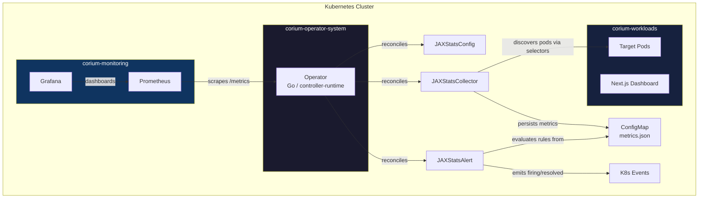

# Corium

Kubernetes operator built with Go and Kubebuilder, managing custom CRDs for automated stats collection, threshold-based alerting, and monitoring -- deployed alongside a Next.js dashboard.

## Architecture



### CRD Hierarchy

```
JAXStatsConfig ──referenced by──> JAXStatsCollector ──referenced by──> JAXStatsAlert
                                        │                                    │
                                        ▼                                    ▼
                                    ConfigMap                           K8s Events
                                  (pod metrics)                    (alert notifications)
```

## Custom Resource Definitions

API group: `stats.corium.io/v1alpha1`

| CRD | Purpose | Key Feature |
|-----|---------|-------------|
| **JAXStatsConfig** | Global collection settings | Finalizer cleans up dependent Collectors on deletion |
| **JAXStatsCollector** | Discovers pods, collects metrics | Persists to owned ConfigMap with owner references |
| **JAXStatsAlert** | Threshold-based alerting | Emits K8s Events (AlertFiring/AlertResolved) with cooldown |

## K8s Patterns

Finalizers, status conditions (`metav1.Condition`), owner references, EventRecorder, cross-resource reconciliation, kubebuilder validation markers (Enum, Min/Max, MinLength), printer columns, NetworkPolicies, namespace isolation, Prometheus custom metrics, Grafana dashboards, ServiceMonitor

## Tech Stack

| Component | Technology |
|-----------|------------|
| Operator | Go 1.24, Kubebuilder v4.6, controller-runtime v0.21 |
| Dashboard | Next.js 14, React 18, Tailwind CSS, Framer Motion |
| CRDs | `stats.corium.io/v1alpha1` (3 resources) |
| Observability | Prometheus + Grafana (kube-prometheus-stack) |
| CI | GitHub Actions (lint, type-check, unit tests, operator tests) |
| Deployment | Kustomize, KinD, NetworkPolicies |

## Project Structure

```
corium/
├── operator/                    # Go Kubernetes operator
│   ├── api/v1alpha1/            # CRD type definitions with validation markers
│   ├── internal/controller/     # Reconciliation controllers + pure functions
│   │   ├── metrics.go           # Prometheus custom metrics registration
│   │   ├── metrics_collector.go # Pod metrics collection (pure, testable)
│   │   └── alert_evaluator.go   # Alert rule evaluation (pure, testable)
│   ├── config/                  # RBAC, CRDs, Kustomize, ServiceMonitor, NetworkPolicy
│   └── Makefile
├── src/                         # Next.js dashboard
├── k8s/                         # Deployment manifests
│   ├── namespaces.yaml          # 3 isolated namespaces
│   ├── network-policies.yaml    # Default-deny + explicit allow rules
│   └── monitoring/              # Prometheus values + Grafana dashboard
├── demo.sh                      # One-command KinD demo
└── .github/workflows/           # CI pipelines
```

## Quick Start

```bash
# Full demo (requires Docker + KinD)
./demo.sh

# Or manually:
cd operator
make install    # Install CRDs
make run        # Run operator locally
kubectl apply -f config/samples/
kubectl get jsc,jscol,jsa
```

See [operator/README.md](operator/README.md) for detailed architecture diagrams and CRD reference.

## License

MIT
