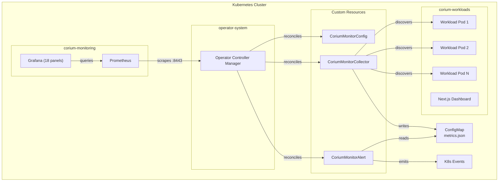
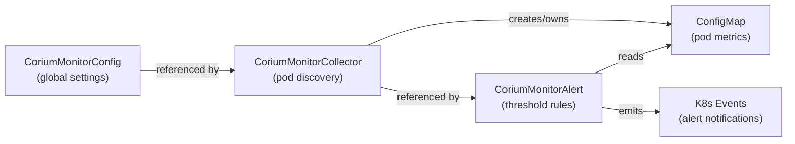
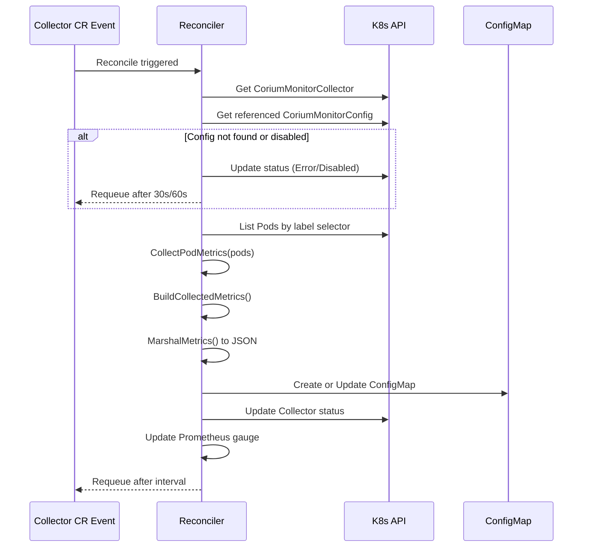
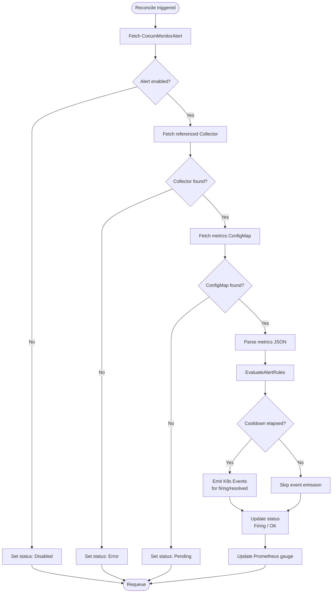
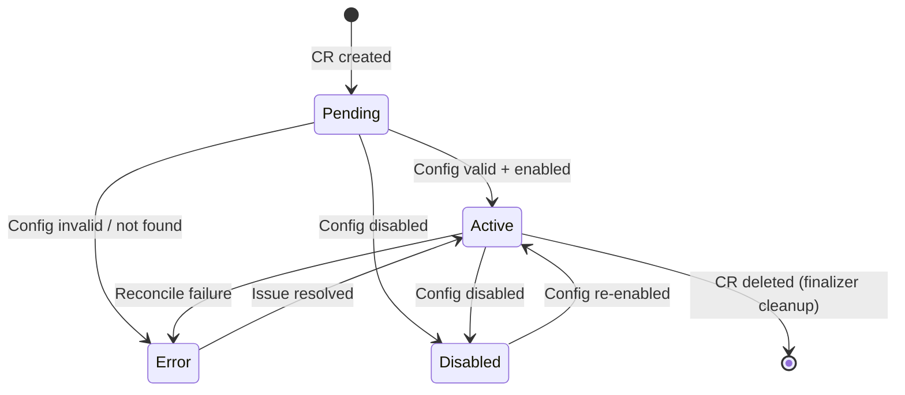

# Corium Operator

Kubernetes operator for automated pod discovery, metrics collection, threshold-based alerting, and monitoring. Built with Go 1.24, Kubebuilder v4.6, and controller-runtime v0.21. Includes full observability with Prometheus custom metrics and an 18-panel Grafana dashboard.

## Architecture

### System Overview



### CRD Dependency Chain

The three CRDs form a directed dependency graph — each resource references the one before it:



### Collector Reconciliation Flow

Each reconciliation loop fetches the CR, validates its referenced Config, discovers pods, collects metrics, persists to a ConfigMap, and updates Prometheus gauges:



### Alert Evaluation Flow

Alerts evaluate threshold rules against collected metrics, enforce cooldown periods, and emit Kubernetes Events:



### Resource Lifecycle States

Every CRD follows a consistent state machine with well-defined transitions:



## CRD Reference

### CoriumMonitorConfig

Global configuration that controls what metrics to collect and how often. Owns a finalizer (`monitor.corium.io/config-cleanup`) that cascading-deletes all dependent Collectors when the Config is removed.

| Field | Type | Description |
|-------|------|-------------|
| `spec.enabled` | bool | Enable/disable collection |
| `spec.collectionInterval` | int32 | Collection interval in seconds (10-3600) |
| `spec.metrics` | []string | Metrics to collect |
| `spec.storageConfig.type` | enum | Storage backend: `prometheus`, `configmap`, `elasticsearch` |

### CoriumMonitorCollector

Discovers pods via label selectors in a target namespace, collects their metrics, and persists results to an owned ConfigMap (`{name}-metrics`). Uses owner references so the ConfigMap is automatically garbage-collected when the Collector CR is deleted.

| Field | Type | Description |
|-------|------|-------------|
| `spec.targetNamespace` | string | Namespace to discover pods in |
| `spec.selector` | LabelSelector | Pod label selector |
| `spec.configRef` | string | Name of referenced CoriumMonitorConfig |
| `status.discoveredPods` | int32 | Number of discovered pods |
| `status.metricsConfigMap` | string | Name of the managed ConfigMap |

### CoriumMonitorAlert

Evaluates threshold rules against the Collector's metrics ConfigMap and emits typed Kubernetes Events (`AlertFiring` / `AlertResolved`). Supports configurable cooldown periods to prevent event flooding.

| Field | Type | Description |
|-------|------|-------------|
| `spec.enabled` | bool | Enable/disable alert evaluation |
| `spec.collectorRef` | string | Name of referenced CoriumMonitorCollector |
| `spec.cooldownPeriod` | string | Cooldown between alerts (e.g., "5m") |
| `spec.rules[].metric` | enum | `restart_count`, `not_ready_count`, `container_count`, `pod_count` |
| `spec.rules[].operator` | enum | `>`, `<`, `>=`, `<=`, `==` |
| `spec.rules[].threshold` | string | Numeric threshold value |
| `spec.rules[].severity` | enum | `critical`, `warning`, `info` |
| `status.firingAlertsCount` | int32 | Number of currently firing alerts |

## Kubernetes Patterns Demonstrated

| Pattern | Implementation |
|---------|---------------|
| **Finalizers** | Config controller prevents orphaned Collectors on deletion via `monitor.corium.io/config-cleanup` |
| **Status Conditions** | Standard `metav1.Condition` with `ObservedGeneration` tracking on all 3 CRDs |
| **Owner References** | Collector-owned ConfigMaps auto-deleted on CR removal (K8s garbage collection) |
| **EventRecorder** | Alert controller emits typed AlertFiring/AlertResolved events visible via `kubectl get events` |
| **Cross-resource reconciliation** | Alert reads Collector's ConfigMap; Collector reads Config — forming a dependency chain |
| **Kubebuilder validation markers** | Enum, MinLength, MinItems, Min/Max constraints enforced at admission time |
| **Printer columns** | `kubectl get` shows Enabled, Status, Pods, Firing counts inline without `-o yaml` |
| **NetworkPolicies** | Default-deny per namespace with explicit allow rules for cross-namespace communication |
| **Prometheus custom metrics** | `corium_discovered_pods`, `corium_active_alerts`, `corium_reconcile_errors_total` |
| **Grafana dashboard** | 18-panel dashboard auto-provisioned via ConfigMap sidecar (5 organized rows) |
| **ServiceMonitor** | Prometheus auto-discovers operator scrape target in `operator-system` namespace |
| **Pure function extraction** | Metrics collection and alert evaluation logic extracted into testable pure functions |

## Observability

### Prometheus Metrics

| Metric | Type | Description |
|--------|------|-------------|
| `corium_discovered_pods` | Gauge | Pods currently discovered per Collector |
| `corium_active_alerts` | Gauge | Currently firing alerts per Alert resource |
| `corium_reconcile_errors_total` | Counter | Reconciliation errors per controller |

### Grafana Dashboard (18 panels, 5 rows)

| Row | Panels |
|-----|--------|
| **Overview** | Discovered Pods (stat), Active Alerts (stat), Reconciliation Rate (stat), Error Rate (stat) |
| **Pod Discovery & Collection** | Discovered Pods by Collector (bar gauge), Discovered Pods Over Time (timeseries) |
| **Alerting** | Active Alerts by Resource (gauge), Alert Firing History (timeseries) |
| **Reconciliation Performance** | Errors by Controller (timeseries), Success Rate % (timeseries), Duration p50/p99 (timeseries), Work Queue Depth (timeseries) |
| **Controller Runtime** | Reconciliations/s by Controller (bar chart), Work Queue Latency p99 (timeseries) |

## Testing

- **Framework:** Ginkgo v2 + Gomega (BDD-style)
- **Environment:** envtest bootstraps an in-memory K8s API server shared across all controller tests
- **Pattern:** Tests create CRs in `BeforeEach`, reconcile directly via `reconciler.Reconcile()`, assert status and side-effects, clean up in `AfterEach`
- **Event assertions:** `record.FakeRecorder` captures and verifies K8s events
- **Pure function tests:** `metrics_collector.go` and `alert_evaluator.go` tested independently

## Quick Start

```bash
# Run tests
make test

# Install CRDs
make install

# Run operator locally
make run

# Apply sample resources
kubectl apply -f config/samples/

# Check results
kubectl get cmc,cmcol,cma
kubectl get configmap -l app.kubernetes.io/managed-by=corium-operator
kubectl get events --field-selector reason=AlertFiring
```

## Full Demo

```bash
# One-command demo with KinD
cd .. && ./demo.sh
```

## License

MIT
