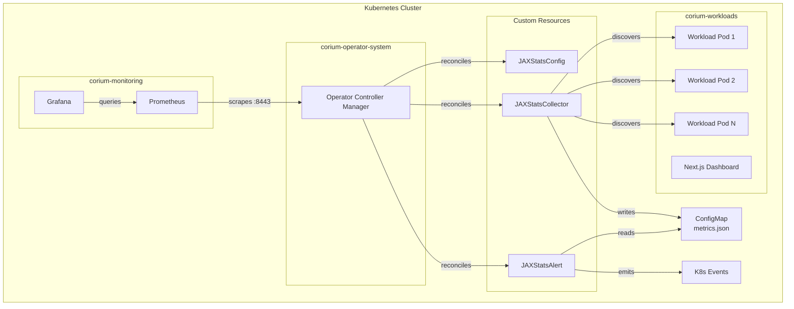
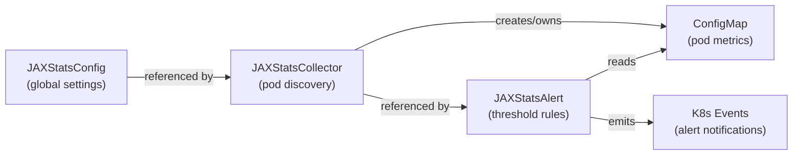
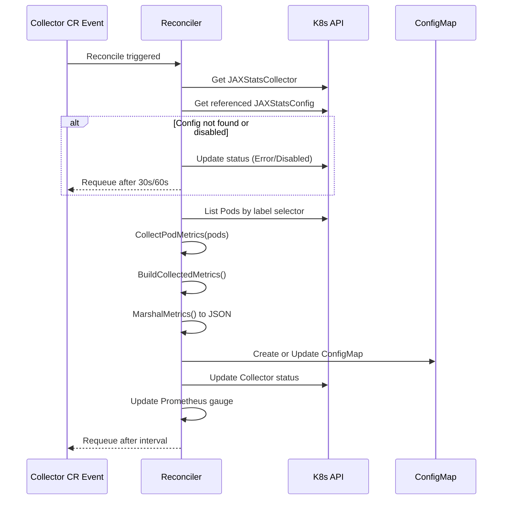
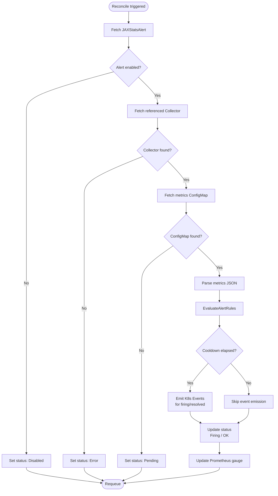
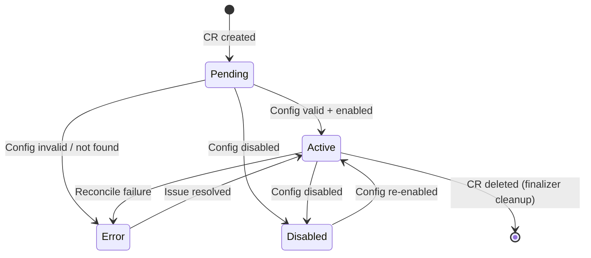

# Corium Operator

Kubernetes operator for automated pod stats collection, threshold-based alerting, and monitoring. Built with Go, Kubebuilder v4.6, and controller-runtime.

## Architecture

### System Overview



### CRD Resource Hierarchy



### Collector Reconciliation Flow



### Alert Evaluation Flow



### Resource Lifecycle States



## CRD Reference

### JAXStatsConfig

Global configuration for stats collection.

| Field | Type | Description |
|-------|------|-------------|
| `spec.enabled` | bool | Enable/disable collection |
| `spec.collectionInterval` | int32 | Collection interval in seconds (10-3600) |
| `spec.metrics` | []string | Metrics to collect |
| `spec.storageConfig.type` | enum | Storage backend: `prometheus`, `configmap`, `elasticsearch` |

### JAXStatsCollector

Discovers pods via label selectors and persists metrics to a ConfigMap.

| Field | Type | Description |
|-------|------|-------------|
| `spec.targetNamespace` | string | Namespace to discover pods in |
| `spec.selector` | LabelSelector | Pod label selector |
| `spec.configRef` | string | Name of referenced JAXStatsConfig |
| `status.discoveredPods` | int32 | Number of discovered pods |
| `status.metricsConfigMap` | string | Name of the managed ConfigMap |

### JAXStatsAlert

Evaluates threshold rules against collected metrics and emits K8s Events.

| Field | Type | Description |
|-------|------|-------------|
| `spec.enabled` | bool | Enable/disable alert evaluation |
| `spec.collectorRef` | string | Name of referenced JAXStatsCollector |
| `spec.cooldownPeriod` | string | Cooldown between alerts (e.g., "5m") |
| `spec.rules[].metric` | enum | `restart_count`, `not_ready_count`, `container_count`, `pod_count` |
| `spec.rules[].operator` | enum | `>`, `<`, `>=`, `<=`, `==` |
| `spec.rules[].threshold` | string | Numeric threshold value |
| `spec.rules[].severity` | enum | `critical`, `warning`, `info` |
| `status.firingAlertsCount` | int32 | Number of currently firing alerts |

## K8s Patterns Demonstrated

- **Finalizers** -- Config cleanup of dependent Collectors on deletion
- **Status Conditions** -- Standard `metav1.Condition` with `ObservedGeneration`
- **Owner References** -- Collector-owned ConfigMaps auto-deleted on CR removal
- **EventRecorder** -- AlertFiring/AlertResolved events visible via `kubectl get events`
- **Cross-resource reconciliation** -- Alert reads Collector's ConfigMap
- **Kubebuilder validation markers** -- Enum, MinLength, MinItems, Min/Max
- **Printer columns** -- `kubectl get` shows Enabled, Status, Pods, Firing counts
- **NetworkPolicies** -- Namespace isolation with explicit allow rules
- **Prometheus custom metrics** -- `jaxstats_discovered_pods`, `jaxstats_active_alerts`, `jaxstats_reconcile_errors_total`
- **Grafana dashboard** -- Pre-built JSON auto-provisioned via ConfigMap sidecar

## Quick Start

```bash
# Run tests
make test

# Install CRDs
make install

# Run operator locally
make run

# Apply sample resources
kubectl apply -f config/samples/

# Check results
kubectl get jsc,jscol,jsa
kubectl get configmap -l app.kubernetes.io/managed-by=jaxstats-operator
kubectl get events --field-selector reason=AlertFiring
```

## Full Demo

```bash
# One-command demo with KinD
cd .. && ./demo.sh
```

## License

MIT
